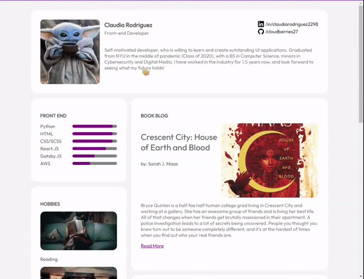

<!-- Please update value in the {}  -->

<h1 align="center">Portfolio</h1>

   Solution for a challenge from  <a href="http://devchallenges.io" target="_blank">Devchallenges.io</a>.

  <h3>
    <a href="https://cloudberries27.github.io/DevChallenge-Portfolio/">
      Demo
    </a>
     | 
    <a href="https://github.com/cloudberries27/DevChallenge-Portfolio/">
      Solution
    </a>
     | 
    <a href="https://devchallenges.io/challenges/5ZnOYsSXM24JWnCsNFlt">
      Challenge
    </a>
  </h3>

<!-- TABLE OF CONTENTS -->

## Table of Contents

- [Overview](#overview)
  - [Built With](#built-with)
- [Features](#features)
- [Acknowledgements](#acknowledgements)
- [Contact](#contact)

<!-- OVERVIEW -->

## Overview

- Demo is above ^^
- This was a CHALLENGE! Guys this was hard like going back to vanilla javascript I was like wow, I am so dependent on bootstrap, don't even know how to paginate without it smh. Anyway I did in fact figure things out and low key proud for doing it on my own. 
- I learned how to paginate and filter using vanilla javascript.
- Quote of the Day: 

### Built With

<!-- This section should list any major frameworks that you built your project using. Here are a few examples.-->

- HTML
- CSS
- Javascript (and like a lot this time lol)

## Features

<!-- List the features of your application or follow the template. Don't share the figma file here :) -->

This application/site was created as a submission to a [DevChallenges](https://devchallenges.io/challenges) challenge. The [challenge](https://devchallenges.io/challenges/5ZnOYsSXM24JWnCsNFlt) was to build an application to complete the given user stories.

## Acknowledgements

<!-- This section should list any articles or add-ons/plugins that helps you to complete the project. This is optional but it will help you in the future. For example: -->

- [Filtering By Tags](https://dev.to/dhintz89/simple-filters-in-css-or-js-185k)
- [Pagination](https://medium.com/geekculture/building-a-javascript-pagination-as-simple-as-possible-a9c32dbf4ac1)
- [Material Icons](https://fonts.google.com/icons)

## Contact

- Website [fanamera.com](https://fanamera.com)
- GitHub [@cloudberries27](https://github.com/cloudberries27)
- Codepen [@cloudberries27](https://codepen.io/cloudberries27)

